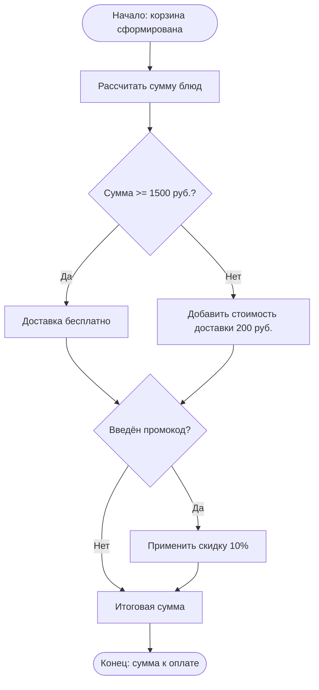

# Flowchart — расчёт итоговой стоимости заказа

```mermaid
flowchart TD
    A([Начало: корзина сформирована]) --> B[Рассчитать сумму блюд]
    B --> C{Сумма >= 1500 руб.?}
    C -- Да --> D[Доставка бесплатно]
    C -- Нет --> E[Добавить стоимость доставки 200 руб.]
    D --> F{Введён промокод?}
    E --> F
    F -- Да --> G[Применить скидку 10%]
    F -- Нет --> H[Итоговая сумма]
    G --> H
    H --> I([Конец: сумма к оплате])
```