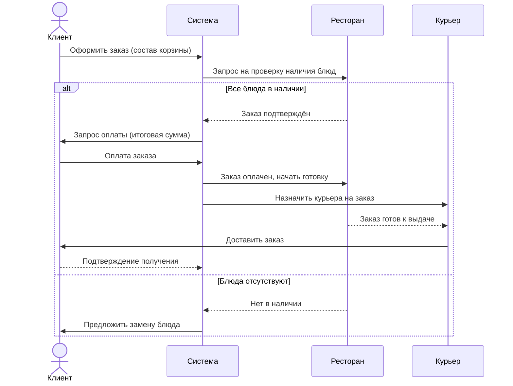

# Sequence Diagram — сценарий оформления и доставки заказа

```mermaid
sequenceDiagram
    actor Клиент
    participant Система
    participant Ресторан
    participant Курьер

    Клиент->>Система: Оформить заказ (состав корзины)
    Система->>Ресторан: Запрос на проверку наличия блюд

    alt Все блюда в наличии
        Ресторан-->>Система: Заказ подтверждён
        Система->>Клиент: Запрос оплаты (итоговая сумма)
        Клиент->>Система: Оплата заказа
        Система->>Ресторан: Заказ оплачен, начать готовку
        Система->>Курьер: Назначить курьера на заказ
        Ресторан-->>Курьер: Заказ готов к выдаче
        Курьер->>Клиент: Доставить заказ
        Клиент-->>Система: Подтверждение получения
    else Блюда отсутствуют
        Ресторан-->>Система: Нет в наличии
        Система->>Клиент: Предложить замену блюда
    end
```